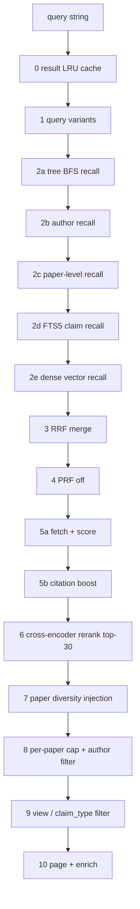

# PAW use case audit (Phase 2 of the search system roadmap)

*Run date: 2026-05-29. Companion to
[2026-05-29-phase1-attribution.md](2026-05-29-phase1-attribution.md)
which established the rerank, not recall, is the nDCG@10 bottleneck.*

## Goal

Phase 1 established that the current MS-MARCO cross-encoder rerank is
the nDCG@10 bottleneck — keyword expansion only adds noise to it. This
audit asks: **where else in the search pipeline could PAW add value?**
For each candidate use case, score on:

* **Expected lift** — what nDCG@10 / UX delta is plausible given Phase 1.
* **Latency budget** — cost per query at ~50-500 ms / PAW call.
* **Wiring complexity** — how many touch points in
  [src/chemtree/](../../src/chemtree/) and whether it composes with the
  current `CHEMTREE_*` kill-switch pattern.
* **Eval-readiness** — do we have labels / probes today, or need to author?
* **Cross-encoder interaction** — does the PAW path bypass or feed
  the rerank? Phase 1 said feeding the rerank hurts; bypassing or
  replacing it is the safer pattern.

## The search pipeline as a target surface

Stages from [docs/search-pipeline.md](../search-pipeline.md):

PAW could touch stages 1, 2a-e (recall), 6 (rerank), 7 (diversity), 8
(filter), 9 (view), or live offline at index time.

## Candidates

### A. Claim relevance scorer (PAW reranker)

* **I/O**: `(query, claim_text) -> {not_relevant, somewhat, highly, exact}`
  (4-class) or `{0, 1, 2}` to match `labels_v1.jsonl` directly.
* **Stage**: 6 (rerank), supplements or replaces
  [src/chemtree/cross_encoder_rerank.py](../../src/chemtree/cross_encoder_rerank.py).
* **Expected lift**: **High.** Directly addresses the bottleneck Phase 1
  identified. Most-likely-to-help PAW use case. The PAW docs case study at
  [programasweights.readthedocs.io/.../semantic-search](https://programasweights.readthedocs.io/en/latest/case-studies/semantic-search/)
  uses exactly this 4-class pattern.
* **Latency**: 200-500 ms / call. Top-30 full-replace = 6-15 s (too slow).
  Top-5 gate after MS-MARCO = 1-2.5 s overhead. Disagreement-only = variable.
* **Wiring**: Swap or wrap `cross_rerank` in
  [src/chemtree/cross_encoder_rerank.py](../../src/chemtree/cross_encoder_rerank.py)
  with a PAW-backed implementation. Behind `CHEMTREE_PAW_RERANK=1`.
* **Eval-readiness**: **Best in class.** `data/eval/labels_v1.jsonl` has
  **7,483 (probe, claim) -> {0,1,2} judgements** across 80 probes. No new
  probes needed. Stratified subsample of ~300 pairs for the unit bench;
  full-suite rerun for end-to-end nDCG@10.
* **Cross-encoder interaction**: Replaces or wraps it — does not feed it.
  Phase 1's augmented-query failure mode is avoided.
* **Risks**: Latency dominates. Top-5 gate is the realistic shipping
  pattern. PAW reranker trained on Gemini labels inherits Gemini's
  notion of relevance.

**Verdict: TOP PRIORITY. Prototype in Phase 3.**

### B. View predictor

* **I/O**: `query -> {by_reaction_type, by_substance_class, by_technique,
  by_application, by_mechanism, by_claim_type, by_author}`.
* **Stage**: 0.5 (pre-pipeline, replaces the rule-based
  `server._get_intent` override at [src/chemtree/server.py](../../src/chemtree/server.py)
  L477). Output feeds stage 9's view filter.
* **Expected lift**: **Medium.** The existing rule-based intent override
  already catches the homonym cases (Suzuki coupling -> reaction). PAW
  could be more nuanced (e.g. "EPR spectroscopy radical species" -> by_technique
  rather than by_application), but the view filter only affects probes
  where users explicitly choose a view (which most don't). Affects the
  `view` UI more than nDCG@10 on the unfiltered eval set.
* **Latency**: <100 ms / call (small input). Cheap.
* **Wiring**: Replace the body of `server._get_intent` with a PAW call.
  Behind `CHEMTREE_PAW_VIEW=1`. The existing
  [src/chemtree/paw_functions.py:classify_intent](../../src/chemtree/paw_functions.py)
  already does 5-way; extend to 7-way for views.
* **Eval-readiness**: Need to derive view-truth labels — can be done
  programmatically by intersecting `labels_v1.jsonl` claim views with
  probe families, or by hand-labelling ~50 queries.
* **Cross-encoder interaction**: None directly. Could narrow the
  recall pool feeding the rerank, indirectly improving nDCG@10 on
  view-filtered queries.
* **Risks**: Doesn't address the rerank bottleneck. Most production
  queries don't filter by view, so the impact on default nDCG@10 is
  small.

**Verdict: DEFERRED. Useful but not high-leverage. Pick up after
Phase 3 reranker work.**

### C. Within-paper claim selector

* **I/O**: `(query, [claim_1, claim_2, ..., claim_n_from_one_paper]) ->
  claim_id`.
* **Stage**: 7 (paper diversity injection), replaces the heuristic
  `INJECT_PER_PAPER=1` constant in
  [src/chemtree/db.py](../../src/chemtree/db.py).
* **Expected lift**: **Low-medium.** Stage 7 only fires when a paper
  surfaces in `paper_dois` but its claims missed the primary top-K.
  Phase 1 showed every probe already has a relevant top-10 claim from
  the dense channel — paper diversity injection's marginal impact is
  small.
* **Latency**: 100-300 ms × papers-needing-injection (typically 0-3
  per query). Modest.
* **Wiring**: Replace the `_paper_diversity_inject` helper with a
  PAW-call-per-paper picker. Behind `CHEMTREE_PAW_PAPER_PICK=1`.
* **Eval-readiness**: Need to author probes — `(query, paper_doi) ->
  best_claim_id` per ~30 examples. ~2-3 h authoring work.
* **Cross-encoder interaction**: Adjusts what gets injected into the
  rerank output; doesn't feed the rerank itself. Safe.
* **Risks**: Small surface area; the stage 7 heuristic is already good.
  Hard to measure improvement against current.

**Verdict: DEFERRED. Probe authoring cost outweighs expected lift.**

### D. Query disambiguator

* **I/O**: `homonym query -> disambiguating sense` (e.g. "coupling" ->
  {`reaction_coupling`, `spin_coupling`, `j_coupling_nmr`, ...}).
* **Stage**: 0.5 (pre-pipeline), routes to view-restricted search.
* **Expected lift**: **Low.** The May-14 ablation showed the rule-based
  cross-coupling intent override already handles the high-frequency
  homonyms. The 80-probe set has 10 homonym probes and they score nDCG@10
  = 0.814 (W0) — already strong, low ceiling.
* **Latency**: 50-200 ms / call (small input).
* **Wiring**: New stage between 0 and 1.
* **Eval-readiness**: Need ~20 ambiguous-query probes with labelled
  intended sense. Authoring cost moderate.
* **Cross-encoder interaction**: None.
* **Risks**: Most probes aren't ambiguous; this is a long-tail use case.

**Verdict: DEFERRED. Long tail.**

### E. Snippet / answer generator

* **I/O**: `(query, top_claims) -> 1-line answer summary`.
* **Stage**: After 10 (post-results), a new optional API field.
* **Expected lift**: **High UX value, zero nDCG@10 impact** (doesn't
  touch ranking). Adds a snippet field to `/api/search` responses for
  agent / chatbot consumers.
* **Latency**: 1-3 s / call (longer generation). Too slow for inline
  responses; would need to ship as a separate endpoint with a clear
  latency budget.
* **Wiring**: New stage past 10, new API field, new env knob.
* **Eval-readiness**: Subjective. No automated metric; would need human
  spot-checks or LLM-as-judge.
* **Cross-encoder interaction**: None — runs after the rerank.
* **Risks**: PAW is one-input-one-output; concatenating top claims into
  one input means a long string the model has to summarise. Output
  format is hard to constrain ("write one sentence" sometimes returns
  paragraphs). Better fit for a full LLM (Gemini, Claude) than PAW.

**Verdict: DEFERRED. Wrong-shaped problem for PAW (closer to a small LLM
job).**

### F. Claim quality classifier (offline)

* **I/O**: `claim_text -> {high, medium, low}` quality bucket at index time.
* **Stage**: Index-time (offline), adds a `quality_score` field to
  `claims` table used as a tie-breaker in RRF or as a filter.
* **Expected lift**: **Medium.** Could meaningfully shift the recall
  pool composition by demoting weak claims. The existing
  `is_key_result` field is already a similar signal at a coarser level.
* **Latency**: Zero query-time (offline).
* **Wiring**: Adds a column to `claims`, an ingestion-time PAW call, and a
  small adjustment in the multi-signal scorer at
  [src/chemtree/db.py:_multi_signal_score](../../src/chemtree/db.py)
  L2696. Behind `CHEMTREE_USE_QUALITY=1`.
* **Eval-readiness**: Need a hand-labelled set of ~200 claims for the unit
  bench. Several hours of authoring.
* **Cross-encoder interaction**: None at query time. Could reduce the
  rerank workload if low-quality claims are filtered before stage 6.
* **Risks**: Run-once vs every-ingest cost; need to re-classify ~2.4 M
  claims if we ship. ~2.4 M × 200 ms = 5 days on a single PAW worker.
  Tractable but not trivial.

**Verdict: DEFERRED. Reclassification cost is the limiting factor; revisit
after Phase 3 if reranker doesn't pan out.**

## Audit summary

| # | Use case | Lift | Latency | Wiring | Eval-readiness | Cross-encoder | Verdict |
| --- | --- | --- | --- | --- | --- | --- | --- |
| **A** | **Claim relevance scorer** | **High** | 1-2.5 s (top-5 gate) | low | **labels_v1 ready** | **replaces** | **Phase 3** |
| B | View predictor | Medium | <100 ms | low | derive from labels_v1 | none | defer |
| C | Within-paper selector | Low-medium | 0-1 s | low | author 30 probes | none | defer |
| D | Query disambiguator | Low | 50-200 ms | low | author 20 probes | none | defer |
| E | Snippet generator | High UX, 0 nDCG | 1-3 s | low | subjective | none | defer (wrong shape) |
| F | Quality classifier | Medium | 0 (offline) | low | author 200 claims | reduces workload | defer (re-index cost) |

## Recommendation: Phase 3 targets

* **Primary**: A — Claim relevance scorer (PAW reranker). The only
  candidate that directly addresses the Phase 1 bottleneck, has
  ready-to-use ground truth (`labels_v1.jsonl`'s 7,483 pairs), and
  bypasses rather than feeds the cross-encoder. Build the unit bench
  on a stratified ~300-pair subsample; run end-to-end nDCG@10 with the
  full-replace, top-5 gate, and disagreement-only patterns.

* **Secondary**: None of the deferred candidates beat A on the
  lift × eval-readiness axis. **Recommend pivoting Phase 3 from
  "top 2 use cases" to "top 1 use case with three deployment patterns"**.
  That is: spend the second prototype budget on **iterating reranker
  spec variants** (R0-R4) and **measuring full-replace vs top-K-gate
  vs disagreement-only** rather than starting a second use case from
  scratch.

This is a scope reduction from the parent plan, justified by the
overwhelming superiority of A on the audit dimensions. If the reranker
prototype proves negative, the natural next step is B (view predictor)
which has the second-best eval-readiness.

## What this audit didn't consider

* **PAW for non-search features** (e.g. paper submission classification,
  claim-extraction pipeline). Out of scope.
* **Hybrid PAW + cross-encoder ensembles** (averaging or boosting
  scores). Could be valuable; covered as a deployment pattern in Phase 3.
* **PAW for re-architecting the recall channels** (e.g. PAW-based FTS
  query generation). Probably a worse fit than the existing FTS5 + dense
  combo, given Phase 1 showed recall isn't bottlenecked.
