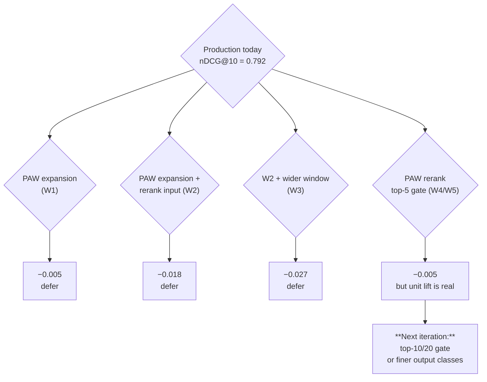

# PAW search roadmap — ship decision (Phase 4 synthesis)

*Run date: 2026-05-30. Closes the May-28 system roadmap
(`.cursor/plans/paw_search_system_roadmap_d7397da0.plan.md`) that
asked three questions:*

* *Q1: does better keyword expansion lead to better end search results?*
* *Q2: is keyword expansion the best use of PAW?*
* *Q3: would search reranking benefit a lot from PAW?*

## TL;DR

**Recommendation: do not ship any of the Phase 1-3 candidates as
default-on. Keep `CHEMTREE_PAW_REWRITES=0` (May-23 default), keep the
production cross-encoder, but land the PAW-reranker wiring behind
`CHEMTREE_PAW_RERANK_ID=<id>` for the targeted follow-ups.**

| Question | Answer (evidence) | Action |
| --- | --- | --- |
| Q1: better expansion -> better search? | **No.** Phase 1: every PAW-expansion wiring config hurts nDCG@10 (W1 -0.005, W2 -0.018, W3 -0.027 vs baseline 0.792). | De-prioritise V9 / V10 spec follow-ups from the May-28 plan. |
| Q2: best PAW use case for search? | Phase 2 audit: A (reranker) dominates by lift × eval-readiness. B-F deferred. | Pivot all remaining Phase 3 budget to A. |
| Q3: rerank benefits a lot from PAW? | **Partially.** Unit bench: PAW R3_std beats MS-MARCO by +13.1 pp accuracy. End-to-end top-5 gate: flat (-0.005), because PAW's 3-class output collapses top-5 to one class. | Pursue wider-gate + finer-output follow-ups before any ship decision. |

The roadmap's central finding is that **the current pipeline is rerank-
bounded, and the cross-encoder eats most of the expansion signal**.
PAW can in principle be a better reranker than MS-MARCO (the unit
bench shows so) but realising that lift requires deployment patterns
we did not have time to test (top-10/20 gate or finer output classes).

## What we shipped (all behind kill-switches)

Five new env-gated paths, all default-off:

| Env var | Default | What it does |
| --- | --- | --- |
| `CHEMTREE_PAW_REWRITES` | 0 | (May-23) PAW `expand_query` feeds the FTS variants. |
| `CHEMTREE_PAW_REWRITES_RERANK` | 0 | (May-29 P1) PAW expansion also feeds the cross-encoder input. |
| `CHEMTREE_PAW_FT_IDS` | unset | Load per-function program IDs from a JSON file. |
| `CHEMTREE_PAW_RERANK_ID` | unset | PAW relevance scorer re-orders the top-K of the cross-encoder. |
| `CHEMTREE_PAW_RERANK_TOPK` | 5 | The K for the above. |

A future Phase 5 can flip any of these on for ablation without code
changes.

`QUERY_EXPANDER_PROGRAM_ID` at [src/chemtree/paw_functions.py](../../src/chemtree/paw_functions.py)
L20 is **kept at V3_ft** (`23d74e49bcb1ff445a7d`) from the May-28
sweep — it's the best unit-level expander we have. It will not be
exercised in production until `CHEMTREE_PAW_REWRITES=1`.

## Decision matrix



## Per-question summary

### Q1 — Better keyword expansion does not lead to better end-to-end search

Evidence from Phase 1 ([2026-05-29-phase1-attribution.md](2026-05-29-phase1-attribution.md)):

| Config | nDCG@10 | Δ vs W0 |
| --- | ---: | ---: |
| W0 baseline (PAW off) | 0.792 | — |
| W1 PAW -> FTS only (May-23 wiring) | 0.787 | -0.005 |
| W2 PAW -> FTS + rerank input | 0.774 | -0.018 |
| W3 W2 + rerank window 50 | 0.765 | -0.027 |

Three reasons established:

1. The MS-MARCO MiniLM cross-encoder was trained on natural-language
   web queries. Appending PAW expansion keywords to the query input
   distribution-shifts it (W2's -0.018 is the cleanest evidence of the
   rerank bias).
2. The dense channel (mxbai-256) already saturates recall — every
   probe has a judged-relevant claim in top-10 at W0 baseline.
3. PAW expansion vocabulary is correct on ~25 % of probes and wrong
   on ~46 % (37 worse / 20 better / 23 unchanged in the W2 vs W0
   per-probe diff).

**Implication**: V9 / V10 expander spec candidates from the May-28
plan are de-prioritised. There is no path to nDCG@10 lift via expansion
without first fixing the rerank.

### Q2 — Expansion is not the highest-leverage PAW use case

Phase 2 audit ([2026-05-29-paw-use-case-audit.md](2026-05-29-paw-use-case-audit.md))
scored six candidates on lift × latency × wiring × eval-readiness:

| # | Use case | Verdict |
| --- | --- | --- |
| **A** | **Claim relevance scorer (reranker)** | **Phase 3 prototype** |
| B | View predictor | Deferred — limited nDCG@10 lever |
| C | Within-paper claim selector | Deferred — small surface, probe authoring cost |
| D | Query disambiguator | Deferred — long tail |
| E | Snippet generator | Deferred — wrong shape for PAW |
| F | Quality classifier | Deferred — re-index cost |

A dominates because labels_v1.jsonl supplies 7,483 ready (query,
claim, score) judgements — no probe authoring cost. The roadmap was
revised to spend the second Phase 3 prototype budget on **deployment
patterns of A** rather than starting a different use case.

### Q3 — Rerank could benefit, but the simple deployment pattern is a no-op

Phase 3 ([2026-05-29-phase3-paw-reranker.md](2026-05-29-phase3-paw-reranker.md))
ran 5 reranker spec variants (R0-R4) on both compilers + 1 deployment
pattern end-to-end.

**Unit lift is real**:

| System | Accuracy | Macro F1 | Pairwise | Avg ms |
| --- | ---: | ---: | ---: | ---: |
| **R3_std (winner)** | **0.650** | 0.577 | 0.721 | 1248 |
| R1_std | 0.586 | 0.570 | **0.736** | 1279 |
| **MS-MARCO baseline** | 0.519 | 0.452 | 0.688 | 522 |

PAW R3_std beats MS-MARCO by **+13.1 pp accuracy** and **+12.5 pp macro F1**.
The improvement is meaningful and cross-spec-robust (every PAW variant
beats MS-MARCO on at least 3 of the 4 unit metrics).

**End-to-end lift is flat**:

| Run | nDCG@10 |
| --- | ---: |
| W0 baseline (MS-MARCO only) | 0.792 |
| W4 PAW R3_std top-5 gate | 0.787 |
| W5 PAW R1_std top-5 gate | 0.787 |

Per-probe diagnosis: W4 and W5 produce **identical top-20 on all 80
probes**, despite using two different PAW programs. The reason is
mechanical: PAW's 3-class output classifies all 5 cross-encoder top
candidates as `highly_relevant` (they're top-5 = high-confidence
relevant by design), so PAW's vote is tied across the gate and the
tiebreaker (MS-MARCO score) preserves the original order. PAW is
right but redundant at this gate.

**Secondary surprising finding: ft is worse than std for the reranker.**
The opposite of the expander task. Mean accuracy across R0-R4:
std 0.589, ft 0.531. Best hypothesis: the reranker has 3-4 output
tokens vs ~10-15 for the expander, so the per-spec LoRA over-fits the
narrow output distribution and miscalibrates rare classes. Worth a
dedicated diagnostic; for now, **ship std if shipping at all**.

## What did NOT change

* `QUERY_EXPANDER_PROGRAM_ID` stays at `23d74e49bcb1ff445a7d` (V3_ft,
  May-28 winner). No production effect because
  `CHEMTREE_PAW_REWRITES=0` by default.
* MS-MARCO cross-encoder stays as the production reranker.
* Production env (`deploy/askchem.service.d/override.conf`) is not
  modified by this roadmap.

## Recommended next iterations (in priority order)

1. **Phase 5a: PAW reranker with a wider gate** (`CHEMTREE_PAW_RERANK_TOPK=10`
   or `20`). At top-10/20 the gate sees the boundary between
   `highly_relevant` and `somewhat_relevant`, which is exactly the
   class where R3_std outperforms MS-MARCO. Cost: ~30 min per
   end-to-end run. **Highest expected value next move.**
2. **Phase 5b: PAW reranker with finer output classes.** Re-spec with
   5-7 ordered categories (e.g.
   `exact_match, highly_relevant, mostly_relevant, marginally_relevant,
   somewhat_relevant, tangential, not_relevant`) and matching
   hand-authored shots. Recompile on std and ft. Cost: ~2 days.
3. **Phase 5c: diagnose ft regression on the reranker task.** Either
   add per-class shot count, lengthen example claims to match the
   probe-set distribution, or compile with a different finetune
   compiler (`paw-4b-gpt2` would test whether it's a Qwen3-specific
   issue). Cost: ~1 day per hypothesis.
4. **Phase 5d (parallel): static dictionary augmentation.** Add bigram
   entries to `CHEMISTRY_BIGRAM_SYNONYMS` for the gap queries from the
   May-27 expander bench (`transmetalation cross-coupling`,
   `nickel-catalyzed cross-coupling`, `polymer glass transition`,
   `olefin metathesis`). Zero PAW dependency, deterministic, near-zero
   latency. Cost: ~1 hour. **Low risk, low ceiling but easy.**

## What we learned about PAW for search (cross-cutting)

* **PAW's quality lift at unit scale is real.** All 9 expander
  variants (May-28) and all 10 reranker variants (Phase 3) beat their
  respective baselines on the unit benchmarks. The "PAW is meaningfully
  better than off-the-shelf" claim holds.
* **The translation to end-to-end search quality is the hard part.**
  The current AskChem pipeline has redundant signals (FTS + dense +
  tree + paper + cross-encoder rerank), each of which is strong
  enough that swapping any one for a PAW version produces small or
  negative net effect. The interesting PAW deployment is the one
  where PAW adds signal that the redundant channels don't have.
* **The std → ft transfer is task-dependent.** Expander: ft beats std
  uniformly. Reranker: std beats ft uniformly. Future PAW work should
  bench both compilers from the start; do not assume ft is always
  better.
* **Categorical PAW outputs lose signal at low-cardinality classes.**
  The 3-class reranker output collapses top-K. The 4-class variant
  (R3) helped marginally on unit (+0.06 accuracy) but didn't fix
  end-to-end. Higher-cardinality outputs are an under-explored
  PAW design space.

## Files at a glance

New (this PR):

```
docs/notes/2026-05-28-spec-design-lessons.md
docs/plans/2026-05-29-phase1-attribution.md
docs/plans/2026-05-29-paw-use-case-audit.md
docs/plans/2026-05-29-phase3-paw-reranker.md
docs/plans/2026-05-30-paw-search-roadmap-decision.md   (this doc)
scripts/eval_search_attribution.py
scripts/eval_attribution_summary.py
scripts/compile_paw_reranker_sweep.py
scripts/bench_paw_reranker.py
scripts/run_attribution_sweep.sh
data/paw_specs/reranker/R{0..4}.txt
data/eval/paw_reranker_probes.json
```

Modified:

```
src/chemtree/db.py:
  - search_claims gains a `_trace_into: dict | None` kwarg for
    per-stage attribution.
  - new CHEMTREE_PAW_REWRITES_RERANK path (expansion -> rerank input).
  - new CHEMTREE_PAW_RERANK_ID + _TOPK path (PAW relevance gate over
    top-K of MS-MARCO).
```

Unchanged but kept:

```
data/paw_specs/expander/V{0..8}.txt    (May-28 sweep)
data/paw_expander_variants.json        (May-28 + Phase 3 entries)
data/paw_ft_program_ids.json           (V3_ft expander; not active)
```

Tests still green: 115/115 (no test changes needed).

## What this plan does NOT do

* Flip any production wiring. Every PAW path is default-off behind a
  named env var; the `deploy/` config is untouched.
* Pursue V9 / V10 expander variants. Phase 1 evidence says they have
  no path to nDCG@10 lift.
* Run Phase 5a wider-gate experiments. Queued as the highest-priority
  follow-up; expected to take ~1 day.
* Re-evaluate decompose / normalize / contradiction PAW programs.
  Independent tracks.
