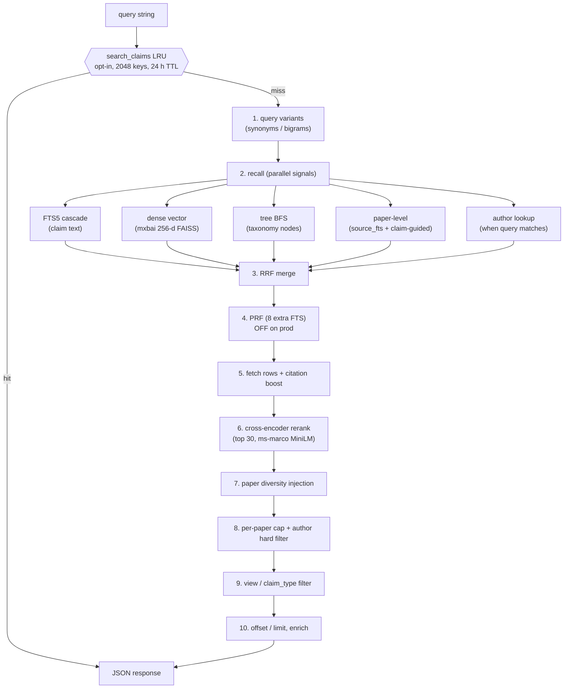

# Search Pipeline (internal reference)

Last updated: 2026-05-18. Mirrors what is shipped on prod via
[deploy/askchem.service.d/override.conf](../deploy/askchem.service.d/override.conf).
Internal reference only; not served by the website (FastAPI only mounts
`web/` at `/static/`).

## TL;DR

`db.search_claims` is a hybrid retrieval pipeline over ~2.3M chemistry
claims. It runs five independent recall channels (FTS, dense vectors,
tree-BFS, paper-level recall, author lookup), fuses them with
Reciprocal Rank Fusion, optionally expands with Pseudo-Relevance
Feedback, reranks the top window with a cross-encoder, diversifies by
paper, applies user filters, and serves out of a result-LRU cache.
Prod (8 vCPU Intel) warm p50 is **9-11 ms** on box / **45-80 ms** over
public HTTPS with keep-alive; cold p50 is **~2.25 s**.

## Pipeline

Stage numbers match the `① … ⑥c` markers inside
[src/askchem/db.py](../src/askchem/db.py) `search_claims` (L3184).

## Stages

| # | Stage | What it does | Tuned by |
|---|---|---|---|
| 0 | Result cache | LRU short-circuits identical `(query, claim_type, view, limit, offset, use_semantic)` keys. | `CHEMTREE_SEARCH_CACHE`, `CHEMTREE_SEARCH_CACHE_SIZE`, `CHEMTREE_SEARCH_CACHE_TTL_S` |
| 1 | Query variants | `expand_query_variants` + author-name extraction. PAW `expand_query` falls through to identity when disabled. Optional PAW expander variant (gated on `CHEMTREE_PAW_REWRITES=1`, default off; see May-23 ablation below). | `CHEMTREE_DISABLE_PAW`, `CHEMTREE_PAW_REWRITES` |
| 2a | Tree-BFS recall | Match query to taxonomy node names, BFS the subtree, pool claims. | `CHEMTREE_DISABLE_TREE_RERANK`, `CHEMTREE_TREE_MIN_SCORE` |
| 2b | Author recall | Triggered when the query looks like a person name; pulls top papers + claim ids for those papers. | n/a (rule-based gate) |
| 2c | Paper-level recall | `source_fts` over title/abstract (path A) plus claim-guided lookup (path B), citation-boosted. | constants in `db.py` |
| 2d | FTS5 claim recall | Cascading FTS query (strict -> relaxed -> stemmed) over all query variants. PAW `normalize_query` is tried as a fallback when zero hits; PAW `decompose_query` is a further fallback when normalize also returns zero (gated on `CHEMTREE_PAW_REWRITES=1`). | `CHEMTREE_DISABLE_WEAK_STEM_SKIP`, `CHEMTREE_PAW_REWRITES` |
| 2e | Dense vector recall | mxbai-embed-large-v1 query, FAISS `IndexFlatIP` over 256-d Matryoshka-truncated claim embeddings, min-score gate. | `CHEMTREE_V2_DIM`, `CHEMTREE_DENSE_MIN_SCORE`, `CHEMTREE_FAISS_THREADS`, `CHEMTREE_FAISS_MMAP` |
| 3 | RRF merge | Reciprocal Rank Fusion over the 4-5 ranked lists. Author signal is added twice when triggered. | constant `k=60` |
| 4 | PRF (off) | Expands the top 30 by running 8 extra FTS lookups on co-occurring terms. Disabled on prod. | `CHEMTREE_DISABLE_PRF` |
| 5a | Fetch + score | Load full claim rows, add `_relevance_score = rrf + 0.05 * dense_score`. | n/a |
| 5b | Citation boost | Multiply score by `1 + log(1 + cites) / log(2 + max_cites)`, then resort. | constant `CLAIM_CITE_ALPHA=1.0` |
| 6 | Cross-encoder rerank | `ms-marco-MiniLM-L-6-v2` reorders the top window only. Failures are caught and logged; tail order is preserved. | `CHEMTREE_RERANK_ENABLED`, `CHEMTREE_RERANK_WINDOW`, `CHEMTREE_RERANK_QUANT` (currently fp32) |
| 7 | Paper diversity | If `paper_dois` picked up a paper whose claims missed the primary top, inject one query-relevant claim from it. | constants `INJECT_PER_PAPER=1`, `MAX_TOTAL_INJECTIONS` |
| 8 | Per-paper cap + author hard filter | At most one claim per DOI in the visible window; if the query was an author lookup, drop everything whose DOI is not in the author's paper set. | constant `MAX_PER_DOI=1` |
| 9 | View / claim_type filter | Two-pass view filter: keep claims whose `view_paths[view]` is non-empty AND are independently query-relevant (FTS or vector hit). Loose fallback for niche queries. | `CHEMTREE_DISABLE_TECHNIQUE_STRIPPER`, `CHEMTREE_DISABLE_COUPLING_INTENT_OVERRIDE` |
| 10 | Page + enrich | `results[offset:offset+limit]`, then `enrich_claims_with_source` for paper metadata. | `limit`, `offset` |

## Currently shipped on prod (2026-05-18)

From [deploy/askchem.service.d/override.conf](../deploy/askchem.service.d/override.conf):

- **v2 retrieval**: `CHEMTREE_RETRIEVER_VERSION=v2` (mxbai-embed-large-v1, CLS-pooled).
- **Matryoshka 256-d FAISS, resident**: `CHEMTREE_V2_DIM=256`, `CHEMTREE_FAISS_MMAP=0`. 256-d gives ~4x lower FAISS search cost than native 1024-d on this hardware (memory-bandwidth-bound at 1024-d); resident saves disk-fault overhead at the cost of ~7 s startup time.
- **Cross-encoder ON, top-30 window, max_len=128**: `CHEMTREE_RERANK_ENABLED=1`, `CHEMTREE_RERANK_WINDOW=30`, `CHEMTREE_RERANK_MAX_LEN=128`. Local CPU at OMP=6; integrated rerank ~430 ms (was 1087 ms at default max_len=512). nDCG@10 +0.011 vs the prior Modal-GPU rerank baseline.
- **Modal cross-encoder offload OFF**: the Modal app stays deployed at `min_containers=0` (no cost) as an instant rollback, but `CHEMTREE_REMOTE_RERANK_URL` is unset and the local CPU on 8 vCPU handles rerank.
- **PRF OFF**: `CHEMTREE_DISABLE_PRF=1`. nDCG@10 +4.0%, pre-rerank median -407 ms.
- **Tree semantic rerank OFF**: `CHEMTREE_DISABLE_TREE_RERANK=1`. nDCG@10 +0.5%, p95 -15%.
- **Result LRU ON**: `CHEMTREE_SEARCH_CACHE=1`, size 2048, TTL 86400 s (24 h). Pre-warmed every 6 h by `/etc/cron.d/askchem-prewarm` running `scripts/prewarm_cache.py` (~50 representative queries). Cache-hit p50: 9-11 ms on box, 45-80 ms via public HTTPS.
- **PAW OFF**: `CHEMTREE_DISABLE_PAW=1`. Saves ~640 MB; quality neutral.
- **int8 rerank quant OFF** (commented out): incompatible with `transformers 4.49` `BatchEncoding`; fp32 cross-encoder is in use.
- Droplet: 8 Intel Premium vCPU (Cascade Lake) / 32 GB / 640 GB NVMe (`s-8vcpu-32gb-intel`, resized 2026-05-18 from `s-4vcpu-16gb-amd`). `OMP_NUM_THREADS=6`, `OPENBLAS_NUM_THREADS=6`, `CHEMTREE_FAISS_THREADS=6`.
- Latency: cold p50 = 2253 ms / p95 = 4492 ms on the 80-probe set; cache-weighted p50 ~500 ms end-to-end for the internal tester pool.
- Quality: nDCG@10 = 0.794 on the 80-probe eval set (+0.011 vs the prior 0.783 Modal-GPU baseline).

## Intentionally off (why, one line each)

- **PRF**: improved nDCG@10 by +4% when removed on the eval set; 8 redundant FTS lookups deleted.
- **Tree semantic rerank**: reconstruction of ~800 vectors from FAISS for the tree pool was a tail-latency contributor; quality neutral.
- **PAW** (intent + normalize via `programasweights`): rule-based fallbacks in `server._get_intent` preserve coupling/homonym routing; saves ~640 MB. May-23 ablation re-evaluated this with the new `paw-ft-bs48-20260522` finetune compiler and the rewrite trio wired into ranking — flat at nDCG@10 (Δ = −0.001 vs baseline), +1.6 s p50 latency, so PAW stays off; details in [plans/2026-05-23-paw-ft-rewrites.md](plans/2026-05-23-paw-ft-rewrites.md). The wiring + per-function ID override (`CHEMTREE_PAW_REWRITES`, `CHEMTREE_PAW_FT_IDS`) ship default-off so the next compiler iteration can A/B with a single env-var flip.
- **int8 cross-encoder**: blocked by `BatchEncoding -> dict` mismatch in `transformers 4.49` (fix requires pinning transformers or rewriting predict). Tracking in [docs/plans/2026-05-14-paw-off-and-int8-ablation.md](plans/2026-05-14-paw-off-and-int8-ablation.md).
- **FAISS IVF / approximate dense**: not needed; `IndexFlatIP` at 256-d returns under 100 ms warm on the 4-vCPU droplet.

## Where to look in code

- Orchestrator: [src/askchem/db.py](../src/askchem/db.py) `search_claims` (L3184). Section markers `① ... ⑥c` map 1:1 to the table above.
- RRF + PRF helpers: [src/askchem/db.py](../src/askchem/db.py) `_rrf_merge`, `_pseudo_relevance_feedback`.
- Tree BFS: [src/askchem/db.py](../src/askchem/db.py) `_tree_recall`.
- Dense channel: [src/askchem/embeddings_v2.py](../src/askchem/embeddings_v2.py) + [src/askchem/retrieval.py](../src/askchem/retrieval.py).
- Cross-encoder: [src/askchem/cross_encoder_rerank.py](../src/askchem/cross_encoder_rerank.py).
- PAW fallbacks: [src/askchem/paw_functions.py](../src/askchem/paw_functions.py) (`_check_paw` short-circuits everything when `CHEMTREE_DISABLE_PAW=1`).
- HTTP wrapper: [src/askchem/server.py](../src/askchem/server.py) `/api/search` + `_get_intent`.

## Deeper reading

- [docs/plans/2026-05-03-phase-alpha-gamma-rollout.md](plans/2026-05-03-phase-alpha-gamma-rollout.md) - phase-by-phase rollout narrative, δ1 / δ2 latency chapter, env-var catalogue.
- [data/eval/ablation_2026-05-15.md](../data/eval/ablation_2026-05-15.md) - A1-A6 ablation report (Matryoshka 256-d, rerank window, PRF, tree rerank, result cache) with the final ship decision.
- [docs/plans/2026-05-14-paw-off-and-int8-ablation.md](plans/2026-05-14-paw-off-and-int8-ablation.md) - PAW-off + int8 detail and the transformers incompatibility.
- [docs/plans/2026-05-23-paw-ft-rewrites.md](plans/2026-05-23-paw-ft-rewrites.md) - May-23 re-eval with `paw-ft-bs48-20260522` finetune compiler and rewrite wiring; negative result with rationale.
- [data/eval/do_upgrade_2026-05-18.md](../data/eval/do_upgrade_2026-05-18.md) - 8 vCPU upgrade + Modal drop + rerank `max_len=128` decision, with the 80-probe eval reconfirming nDCG@10 went up not down.
- [docs/plans/2026-05-02-sprint-c-embeddings.md](plans/2026-05-02-sprint-c-embeddings.md), [docs/plans/2026-05-04-sprint-c-rerank-results.md](plans/2026-05-04-sprint-c-rerank-results.md), [docs/plans/2026-04-26-retrieval-upgrade.md](plans/2026-04-26-retrieval-upgrade.md) - design rationale for the dense + cross-encoder choices.

## What this doc is NOT

- Not a user-facing doc. Public API surface is in [docs/api/search.md](api/search.md).
- Not exhaustive on knobs. The full inventory with rationales stays in the override.conf header comments.
- Not a benchmark report. Numbers are summarized at a glance; details stay in the ablation file.
