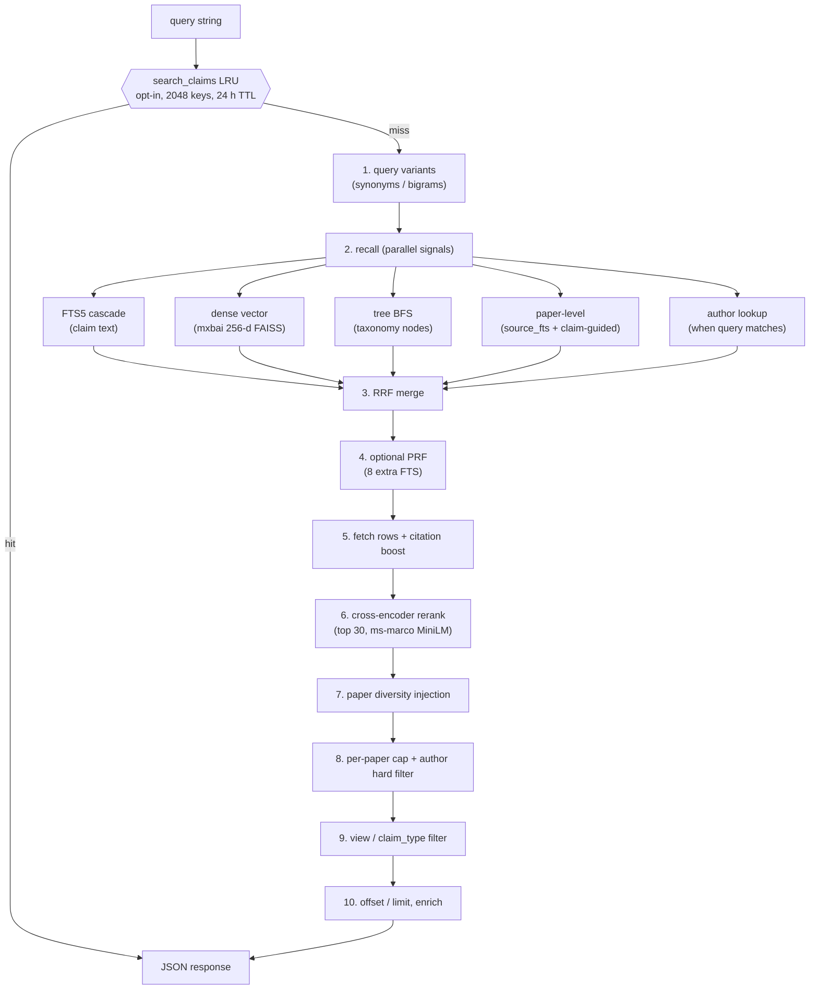

# Search Pipeline

This document describes the configurable hybrid retrieval pipeline used by
AskChem. Exact latency and memory use depend on corpus size, hardware, and the
environment variables selected by each deployment.

## TL;DR

`db.search_claims` is a hybrid retrieval pipeline over ~2.3M chemistry
claims. It runs five independent recall channels (FTS, dense vectors,
tree-BFS, paper-level recall, author lookup), fuses them with
Reciprocal Rank Fusion, optionally expands with Pseudo-Relevance
Feedback, reranks the top window with a cross-encoder, diversifies by
paper, applies user filters, and serves out of a result-LRU cache.

## Pipeline

Stage numbers match the `① … ⑥c` markers inside
[src/askchem/db.py](../src/askchem/db.py) `search_claims` (L3184).

## Stages

| # | Stage | What it does | Tuned by |
|---|---|---|---|
| 0 | Result cache | LRU short-circuits identical `(query, claim_type, view, limit, offset, use_semantic)` keys. | `CHEMTREE_SEARCH_CACHE`, `CHEMTREE_SEARCH_CACHE_SIZE`, `CHEMTREE_SEARCH_CACHE_TTL_S` |
| 1 | Query variants | `expand_query_variants` + author-name extraction. PAW `expand_query` falls through to identity when disabled. Optional PAW expander variant (gated on `CHEMTREE_PAW_REWRITES=1`, default off; see May-23 ablation below). | `CHEMTREE_DISABLE_PAW`, `CHEMTREE_PAW_REWRITES` |
| 2a | Tree-BFS recall | Match query to taxonomy node names, BFS the subtree, pool claims. | `CHEMTREE_DISABLE_TREE_RERANK`, `CHEMTREE_TREE_MIN_SCORE` |
| 2b | Author recall | Triggered when the query looks like a person name; pulls top papers + claim ids for those papers. | n/a (rule-based gate) |
| 2c | Paper-level recall | `source_fts` over title/abstract (path A) plus claim-guided lookup (path B), citation-boosted. | constants in `db.py` |
| 2d | FTS5 claim recall | Cascading FTS query (strict -> relaxed -> stemmed) over all query variants. PAW `normalize_query` is tried as a fallback when zero hits; PAW `decompose_query` is a further fallback when normalize also returns zero (gated on `CHEMTREE_PAW_REWRITES=1`). | `CHEMTREE_DISABLE_WEAK_STEM_SKIP`, `CHEMTREE_PAW_REWRITES` |
| 2e | Dense vector recall | mxbai-embed-large-v1 query, FAISS `IndexFlatIP` over 256-d Matryoshka-truncated claim embeddings, min-score gate. | `CHEMTREE_V2_DIM`, `CHEMTREE_DENSE_MIN_SCORE`, `CHEMTREE_FAISS_THREADS`, `CHEMTREE_FAISS_MMAP` |
| 3 | RRF merge | Reciprocal Rank Fusion over the 4-5 ranked lists. Author signal is added twice when triggered. | constant `k=60` |
| 4 | Optional PRF | Expands the top 30 by running 8 extra FTS lookups on co-occurring terms. | `CHEMTREE_DISABLE_PRF` |
| 5a | Fetch + score | Load full claim rows, add `_relevance_score = rrf + 0.05 * dense_score`. | n/a |
| 5b | Citation boost | Multiply score by `1 + log(1 + cites) / log(2 + max_cites)`, then resort. | constant `CLAIM_CITE_ALPHA=1.0` |
| 6 | Cross-encoder rerank | `ms-marco-MiniLM-L-6-v2` reorders the top window only. Failures are caught and logged; tail order is preserved. | `CHEMTREE_RERANK_ENABLED`, `CHEMTREE_RERANK_WINDOW`, `CHEMTREE_RERANK_QUANT` (currently fp32) |
| 7 | Paper diversity | If `paper_dois` picked up a paper whose claims missed the primary top, inject one query-relevant claim from it. | constants `INJECT_PER_PAPER=1`, `MAX_TOTAL_INJECTIONS` |
| 8 | Per-paper cap + author hard filter | At most one claim per DOI in the visible window; if the query was an author lookup, drop everything whose DOI is not in the author's paper set. | constant `MAX_PER_DOI=1` |
| 9 | View / claim_type filter | Two-pass view filter: keep claims whose `view_paths[view]` is non-empty AND are independently query-relevant (FTS or vector hit). Loose fallback for niche queries. | `CHEMTREE_DISABLE_TECHNIQUE_STRIPPER`, `CHEMTREE_DISABLE_COUPLING_INTENT_OVERRIDE` |
| 10 | Page + enrich | `results[offset:offset+limit]`, then `enrich_claims_with_source` for paper metadata. | `limit`, `offset` |

## Where to look in code

- Orchestrator: [src/askchem/db.py](../src/askchem/db.py) `search_claims` (L3184). Section markers `① ... ⑥c` map 1:1 to the table above.
- RRF + PRF helpers: [src/askchem/db.py](../src/askchem/db.py) `_rrf_merge`, `_pseudo_relevance_feedback`.
- Tree BFS: [src/askchem/db.py](../src/askchem/db.py) `_tree_recall`.
- Dense channel: [src/askchem/embeddings_v2.py](../src/askchem/embeddings_v2.py) + [src/askchem/retrieval.py](../src/askchem/retrieval.py).
- Cross-encoder: [src/askchem/cross_encoder_rerank.py](../src/askchem/cross_encoder_rerank.py).
- PAW fallbacks: [src/askchem/paw_functions.py](../src/askchem/paw_functions.py) (`_check_paw` short-circuits everything when `CHEMTREE_DISABLE_PAW=1`).
- HTTP wrapper: [src/askchem/server.py](../src/askchem/server.py) `/api/search` + `_get_intent`.
